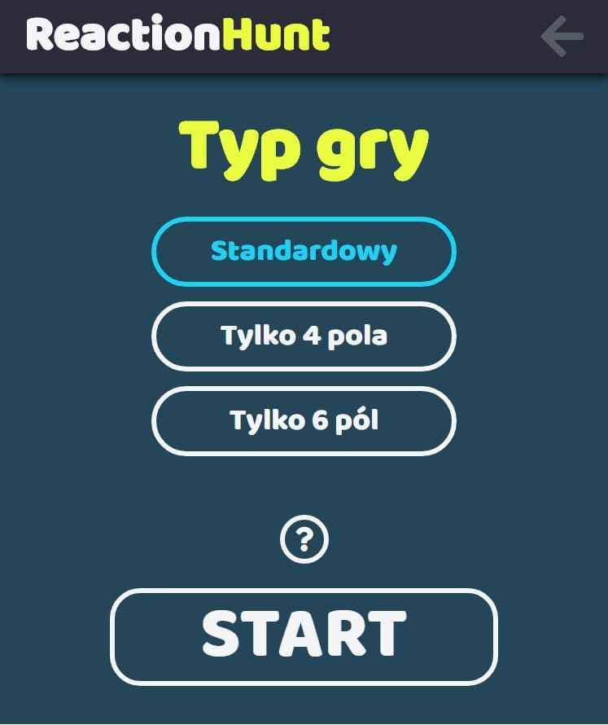
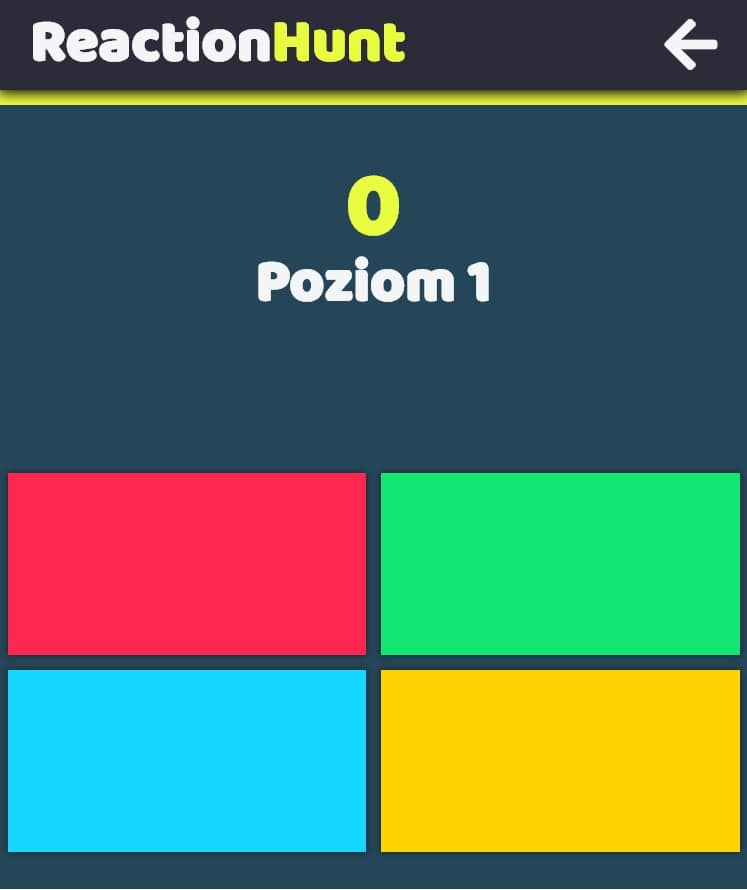
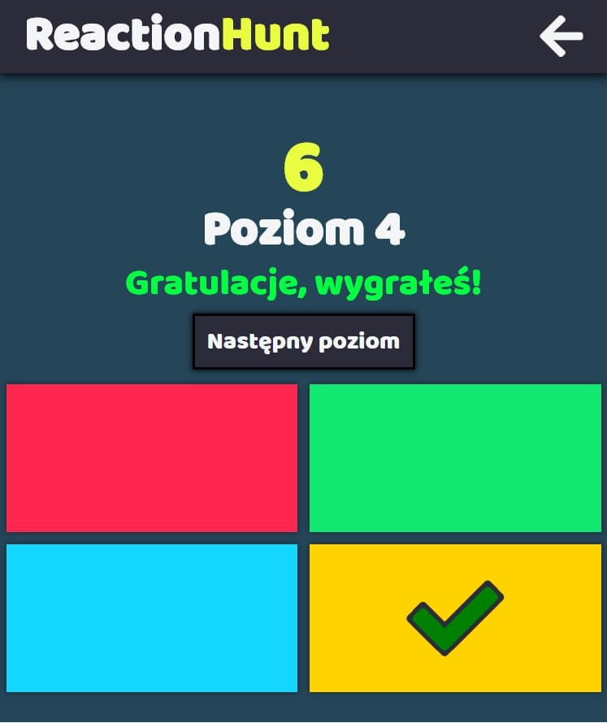

# ReactionHunt

---

**ReactionHunt is the simple game based on React that test player's reaction.**

## Table of contents

---

- [General info](#general-info)
- [Screenshots](#screenshots)
- [Technologies](#technologies)
- [Installation and Setup Instructions](#installation-and-setup-instructions)

## General info

---

The purpose of the project was to practice my React skills and realize my original idea. I like games so I decided to try create one and see how it's feel when you have your own game with your rules.

## Screenshots

---

## Technologies

---

- HTML
- SCSS
- JavaScript - ES6+
- React - version 16.10.2
  - node-sass - version 4.12.0
  - react-timeout - version 1.2.0

## Installation and Setup Instructions

**Live demo: https://zdebcio.github.io/reactionhunt/**

Clone or download this repository. You will need **node** and **npm** installed globally on your machine.
[Download node (includes npm)](https://nodejs.org/en/download/).

Installation:
`npm install`

To Start Server:
`npm start`

To Visit App:
`localhost:3000`
